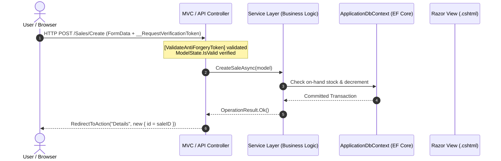

# Controllers & API Routing Architecture (`Docs/Controllers/`)

## 1. Architectural Role of Controllers

In ASP.NET Core MVC, Controllers serve as **coordinators and orchestrators**. They:
1. Accept and bind incoming HTTP requests (Form Posts, Route values, Query parameters, and JSON payloads).
2. Enforce security constraints (Cross-Site Request Forgery validation with `[ValidateAntiForgeryToken]`).
3. Validate client-side input via `ModelState.IsValid`.
4. Delegate domain processing and business operations to the **Service Layer** (`Services/`) via **Constructor Dependency Injection**.
5. Return appropriate HTTP responses: formatted Razor Views, localized redirect responses, or JSON data for client-side AJAX routines.



---

## 2. Controllers Directory Breakdown

The application implements **10 distinct controllers**:

```
Controllers/
├── AIController.cs               # RESTful API for Groq LLM Assistant & Chat Logs
├── CategoriesController.cs       # Category taxonomy management
├── CultureController.cs          # Multi-language cookie persistence & switching
├── DashboardController.cs        # Executive KPI metrics, Chart.js AJAX, Global Search
├── ProductsController.cs         # Product catalog management, filtering, & pagination
├── PurchasesController.cs        # Procurement orders & incoming inventory updates
├── ReportsController.cs          # Financial stock valuation & sales revenue analytics
├── SalesController.cs            # POS checkout, stock deductions, & invoice generation
├── SupplierProductsController.cs # Supplier-product contract pricing & lead times
└── SuppliersController.cs        # Vendor profile management & purchase history
```

---

## 3. Deep-Dive Controller Analysis

### 3.1. `AIController` (`Controllers/AIController.cs`)
- **Type:** RESTful API Controller (`[ApiController]`, `[Route("api/[controller]")]`)
- **Injected Dependencies:** `IAIService`, `ApplicationDbContext`
- **Endpoints & Operations:**

| Endpoint | Verb | Parameters | Responsibility |
| :--- | :--- | :--- | :--- |
| `api/AI/chat` | `[HttpPost]` | `[FromBody] AIRequest request` | Receives natural-language questions, orchestrates RAG context and Groq LLM completion via `IAIService.AskAsync`, persists the query and reply in `AIChatLogs`, and returns a sanitized JSON payload. |
| `api/AI/history` | `[HttpGet]` | `[FromQuery] int limit = 50` | Retrieves recent chat log interactions ordered chronologically so the client-side chat widget can automatically hydrate prior conversation history when opened. |
| `api/AI/clear` | `[HttpPost]`, `[HttpDelete]` | None | Truncates/removes records from the `AIChatLogs` table, providing a clean chat session for the warehouse user. |

---

### 3.2. `DashboardController` (`Controllers/DashboardController.cs`)
- **Type:** MVC Controller (`Controller`)
- **Injected Dependencies:** `ApplicationDbContext`, `IProductService`, `ICategoryService`, `ISupplierService`
- **Endpoints & Operations:**

| Endpoint | Verb | Parameters | Responsibility |
| :--- | :--- | :--- | :--- |
| `Dashboard/Analytics` | `[HttpGet]` | None | Default application route (`{controller=Dashboard}/{action=Analytics}`). Assembles aggregated executive KPIs (Total Products, Low Stock Count, Total Valuation, Sales Revenue, Total Purchases) and timeline items. |
| `Dashboard/GetSalesVsPurchasesChartData` | `[HttpGet]` | None | AJAX endpoint for Chart.js: aggregates monthly sales receipts vs. procurement purchase invoices for the current fiscal year. |
| `Dashboard/GetCategoryDistributionChartData` | `[HttpGet]` | None | AJAX endpoint for Chart.js: counts products grouped by category for donut chart rendering. |
| `Dashboard/GlobalSearch` | `[HttpGet]` | `string term` | Instant debounced autocomplete lookup querying products (by name and SKU) and categories simultaneously. Returns JSON for header search dropdown. |
| `Dashboard/Error` | `[HttpGet]` | None | Standard centralized exception handling page. |

---

### 3.3. `ProductsController` (`Controllers/ProductsController.cs`)
- **Type:** MVC Controller
- **Injected Dependencies:** `IProductService`, `ICategoryService`
- **Endpoints & Operations:**

| Endpoint | Verb | Parameters | Security / Rationale |
| :--- | :--- | :--- | :--- |
| `Products/Index` | `[HttpGet]` | `ProductFilterViewModel filter` | Server-side filtered and paginated catalog grid returning `PagedResult<ProductListItemViewModel>`. |
| `Products/Create` | `[HttpGet]` | None | Populates category dropdown list in `ProductFormViewModel`. |
| `Products/Create` | `[HttpPost]` | `ProductFormViewModel model` | `[ValidateAntiForgeryToken]`. Validates SKU uniqueness and range rules. Calls `IProductService.CreateProductAsync`. |
| `Products/Edit/{id}` | `[HttpGet]` | `int id` | Prepares form model populated with current product data. |
| `Products/Edit/{id}` | `[HttpPost]` | `int id, ProductFormViewModel model` | `[ValidateAntiForgeryToken]`. Verifies ID match to prevent route tampering. Updates product details. |
| `Products/Details/{id}` | `[HttpGet]` | `int id` | Loads product specifications along with active supplier pricing contracts and transaction counters. |
| `Products/Delete/{id}` | `[HttpGet]` | `int id` | Performs referential check. If product has historical sales or purchases, flags `CanDelete = false` and shows blocking reason. |
| `Products/DeleteConfirmed/{id}` | `[HttpPost]` | `int id` | `[ValidateAntiForgeryToken]`. Executes deletion only if zero transaction dependencies exist. |

---

### 3.4. `PurchasesController` (`Controllers/PurchasesController.cs`)
- **Type:** MVC Controller
- **Injected Dependencies:** `ApplicationDbContext`, `ISupplierService`, `IProductService`
- **Endpoints & Operations:**

| Endpoint | Verb | Parameters | Security / Transactional Rationale |
| :--- | :--- | :--- | :--- |
| `Purchases/Index` | `[HttpGet]` | `PurchaseFilterViewModel filter` | Paginated procurement orders list with supplier and date range filtering. |
| `Purchases/Create` | `[HttpGet]` | `int? supplierId` | Prepares procurement order entry builder with available suppliers and product catalog. |
| `Purchases/GetSupplierProducts` | `[HttpGet]` | `int supplierId` | AJAX endpoint: returns products contractually mapped to the selected supplier with pre-filled contract prices. |
| `Purchases/Create` | `[HttpPost]` | `PurchaseFormViewModel model` | `[ValidateAntiForgeryToken]`. **Transactional Execution:** Validates items, saves `Purchase` and `PurchaseItems`, and **increments on-hand `StockQuantity`** for each received product in a single database transaction. |
| `Purchases/Details/{id}` | `[HttpGet]` | `int id` | Displays itemized procurement invoice with costs and totals. |
| `Purchases/Delete/{id}` | `[HttpGet]` | `int id` | Pre-deletion verification with stock deduction warning. |
| `Purchases/DeleteConfirmed/{id}` | `[HttpPost]` | `int id` | `[ValidateAntiForgeryToken]`. **Stock Reversal:** Decrements on-hand stock by the quantities originally purchased before deleting the procurement record. |

---

### 3.5. `SalesController` (`Controllers/SalesController.cs`)
- **Type:** MVC Controller
- **Injected Dependencies:** `ApplicationDbContext`, `IProductService`
- **Endpoints & Operations:**

| Endpoint | Verb | Parameters | Security / Transactional Rationale |
| :--- | :--- | :--- | :--- |
| `Sales/Index` | `[HttpGet]` | `SaleFilterViewModel filter` | Paginated customer sales history with customer search and date filtering. |
| `Sales/Create` | `[HttpGet]` | None | Renders the interactive Point-of-Sale (POS) dynamic checkout interface. Injects full product catalog with current stock quantities for real-time validation. |
| `Sales/Create` | `[HttpPost]` | `SaleFormViewModel model` | `[ValidateAntiForgeryToken]`. **Critical Inventory Deduction:** Validates that requested quantities do not exceed live `StockQuantity`. Decrements inventory stock and records transaction within an atomic transaction. |
| `Sales/Details/{id}` | `[HttpGet]` | `int id` | Displays formatted, printable customer sales invoice with invoice number, store address, line items, and payment confirmation. |
| `Sales/Delete/{id}` | `[HttpGet]` | `int id` | Confirms transaction cancellation. |
| `Sales/DeleteConfirmed/{id}` | `[HttpPost]` | `int id` | `[ValidateAntiForgeryToken]`. **Inventory Stock Reversion:** Restores (increments) sold quantities back into on-hand stock when a sale transaction is voided or cancelled. |

---

### 3.6. `ReportsController` (`Controllers/ReportsController.cs`)
- **Type:** MVC Controller
- **Injected Dependencies:** `ApplicationDbContext`
- **Endpoints & Operations:**

| Endpoint | Verb | Parameters | Analytical Responsibility |
| :--- | :--- | :--- | :--- |
| `Reports/StockValuation` | `[HttpGet]` | `int? categoryId, string? statusFilter, string? search` | Computes full catalog inventory valuation: `Sum(StockQuantity * UnitPrice)`. Evaluates reorder status across catalog. |
| `Reports/ExportStockValuationCsv` | `[HttpGet]` | Filter parameters | Generates and streams a downloadable RFC 4180-compliant CSV file of inventory valuation data. |
| `Reports/SalesReport` | `[HttpGet]` | `DateTime? startDate, DateTime? endDate, string datePreset` | Executive sales performance report: calculates Total Gross Revenue, Total Volume Sold, Average Order Value (AOV), and top-performing products. |
| `Reports/ExportSalesReportCsv` | `[HttpGet]` | Date range parameters | Streams a downloadable CSV report of sales metrics for business accounting. |

---

### 3.7. `CategoriesController` (`Controllers/CategoriesController.cs`)
- **Type:** MVC Controller
- **Injected Dependencies:** `ICategoryService`
- **Endpoints & Operations:**
  - `Index`: Displays categories with assigned product count badges.
  - `Create` / `Edit`: Category taxonomy management with `[ValidateAntiForgeryToken]`.
  - `Delete`: Evaluates `DeleteCheckResult` to strictly block deletion of non-empty categories.

---

### 3.8. `SuppliersController` (`Controllers/SuppliersController.cs`)
- **Type:** MVC Controller
- **Injected Dependencies:** `ISupplierService`
- **Endpoints & Operations:**
  - `Index`: Vendor directory with search and pagination.
  - `Create` / `Edit`: Manages vendor profiles, telephone, and email coordinates.
  - `Details`: Comprehensive vendor portfolio with contract history and purchase records.
  - `Delete`: Blocks deletion if historical purchases exist with this vendor.

---

### 3.9. `SupplierProductsController` (`Controllers/SupplierProductsController.cs`)
- **Type:** MVC Controller
- **Injected Dependencies:** `ISupplierProductService`, `ISupplierService`, `IProductService`
- **Endpoints & Operations:**
  - Manages contract agreements between vendors and catalog products.
  - Enforces uniqueness on `(SupplierID, ProductID)`.
  - Captures contract unit price and fulfillment lead time days.

---

### 3.10. `CultureController` (`Controllers/CultureController.cs`)
- **Type:** MVC Controller
- **Endpoints & Operations:**

| Endpoint | Verb | Parameters | Security & Localization Details |
| :--- | :--- | :--- | :--- |
| `Culture/SetLanguage` | `[HttpPost]` | `string culture, string returnUrl` | `[ValidateAntiForgeryToken]`. Validates that requested culture is in supported whitelist (`en`, `ar`, `fr`, `es`, `it`, `de`). Sets persistent `CookieRequestCultureProvider` cookie with 1-year lifespan. Uses `Url.IsLocalUrl(returnUrl)` to **prevent Open Redirect Phishing attacks** before performing local redirect. |
