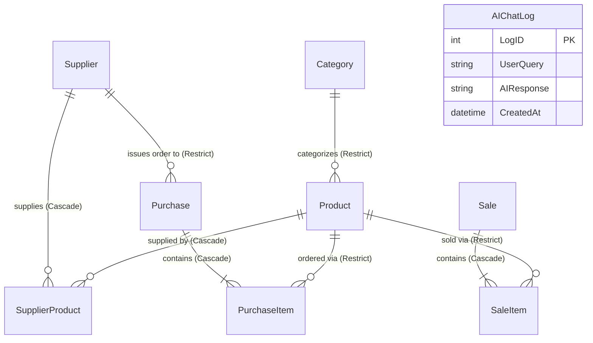

# Models & Database Architecture (`Docs/Models/`)

## 1. Architectural Overview

The Data Access Layer of the Inventory Management System is built on **Entity Framework Core 9.0 (Code-First approach)** backed by Microsoft SQL Server. The domain schema is intentionally structured to preserve referential integrity, historical financial auditability, inventory balance tracking, and AI conversational intelligence.

The domain model contains **9 primary entities**:
1. `Product`
2. `Category`
3. `Supplier`
4. `SupplierProduct`
5. `Purchase`
6. `PurchaseItem`
7. `Sale`
8. `SaleItem`
9. `AIChatLog`

---

## 2. Entity-Relationship Diagram (ERD)



---

## 3. Deep-Dive Entity Breakdown

### 3.1. `Product` (`Models/Product.cs`)
The central entity of the system, representing physical merchandise managed in stock.

| Property | Data Type | Nullability | Constraints & Annotations | Business & Technical Relevance |
| :--- | :--- | :--- | :--- | :--- |
| `ProductID` | `int` | Non-Null | `[Key]` | Primary Key (Identity auto-increment). |
| `SKU` | `string` | Non-Null | `[Required]`, `[StringLength(50)]`, `[Unique]`, EF Unique Index | Stock Keeping Unit; the unique identifier used across barcoding, catalog lookup, and purchase reorders. |
| `ProductName` | `string` | Non-Null | `[Required]`, `[StringLength(100)]` | Human-readable merchandise title shown in POS, orders, and reports. |
| `CategoryID` | `int` | Non-Null | `[Required]` | Foreign Key referencing `Category.CategoryID`. |
| `UnitPrice` | `decimal` | Non-Null | `[Required]`, `[Range(0.01, 100000)]`, `HasPrecision(18,2)` | Selling retail price per unit. Validated to be positive. |
| `StockQuantity` | `int` | Non-Null | `[Required]`, `[Range(0, 10000)]` | Live on-hand inventory count. Dynamically decremented on sale and incremented on purchase reception. |
| `LowStockThreshold` | `int` | Non-Null | `[Required]`, `[Range(0, 1000)]` | Reorder alert trigger. When `StockQuantity <= LowStockThreshold`, the system marks the item as Low Stock and issues alert notifications. |
| `Category` | `Category?` | Nullable Navigation | Virtual Navigation | Reference to parent category. |
| `SupplierProducts` | `ICollection<SupplierProduct>` | Non-Null | Collection Navigation | Mappings of suppliers providing this product under contract. |
| `PurchaseItems` | `ICollection<PurchaseItem>` | Non-Null | Collection Navigation | Historical incoming purchase line items. |
| `SaleItems` | `ICollection<SaleItem>` | Non-Null | Collection Navigation | Historical outgoing sales line items. |

---

### 3.2. `Category` (`Models/Category.cs`)
Represents functional classification groups for items (e.g., Electronics, Beverages, Perishables).

| Property | Data Type | Nullability | Constraints & Annotations | Business & Technical Relevance |
| :--- | :--- | :--- | :--- | :--- |
| `CategoryID` | `int` | Non-Null | `[Key]` | Primary Key. |
| `CategoryName` | `string` | Non-Null | `[Required]`, `[StringLength(100, MinimumLength = 2)]` | Category title used for filtering, grouping, and inventory valuation charts. |
| `Description` | `string?` | Nullable | `[StringLength(500)]` | Optional context describing items in this taxonomy. |
| `Products` | `ICollection<Product>` | Non-Null | Collection Navigation | All products belonging to this category. |

---

### 3.3. `Supplier` (`Models/Supplier.cs`)
Represents external vendors, manufacturers, and distributors supplying inventory.

| Property | Data Type | Nullability | Constraints & Annotations | Business & Technical Relevance |
| :--- | :--- | :--- | :--- | :--- |
| `SupplierID` | `int` | Non-Null | `[Key]` | Primary Key. |
| `SupplierName` | `string` | Non-Null | `[Required]`, `[StringLength(100, MinimumLength = 2)]` | Commercial business name of the supplier. |
| `ContactName` | `string` | Non-Null | `[Required]`, `[StringLength(100)]` | Primary representative / account manager name. |
| `Phone` | `string` | Non-Null | `[Required]`, `[Phone]`, `[StringLength(20)]` | Contact phone for procurement and delivery tracking. |
| `Email` | `string` | Non-Null | `[Required]`, `[EmailAddress]`, `[StringLength(100)]` | Contact email for electronic purchase orders. |
| `Address` | `string` | Non-Null | `[Required]`, `[StringLength(200)]` | Physical/warehouse dispatch location. |
| `SupplierProducts` | `ICollection<SupplierProduct>` | Non-Null | Collection Navigation | Contract agreements linking supplier to specific catalog products. |
| `Purchases` | `ICollection<Purchase>` | Non-Null | Collection Navigation | All historical procurement orders executed with this vendor. |

---

### 3.4. `SupplierProduct` (`Models/SupplierProduct.cs`)
Represents the **Many-to-Many junction entity** with contract attributes between `Supplier` and `Product`.

| Property | Data Type | Nullability | Constraints & Annotations | Business & Technical Relevance |
| :--- | :--- | :--- | :--- | :--- |
| `SupplierProductID` | `int` | Non-Null | `[Key]` | Primary Key of the mapping record. |
| `SupplierID` | `int` | Non-Null | `[Required]`, FK to `Supplier` | Foreign key referencing the supplying vendor. |
| `ProductID` | `int` | Non-Null | `[Required]`, FK to `Product` | Foreign key referencing the catalog product. |
| `SupplierSKU` | `string` | Non-Null | `[Required]`, `[StringLength(50)]` | Vendor's internal part or catalog number. |
| `ContractPrice` | `decimal` | Non-Null | `[Required]`, `[Range(0.01, 100000)]`, `HasPrecision(18,2)` | Agreed wholesale procurement cost per unit under this supplier's contract. |
| `LeadTimeDays` | `int` | Non-Null | `[Required]`, `[Range(1, 365)]` | Expected fulfillment turnaround time in calendar days. |
| `Supplier` | `Supplier?` | Nullable Navigation | Virtual Navigation | Navigation reference to parent `Supplier`. |
| `Product` | `Product?` | Nullable Navigation | Virtual Navigation | Navigation reference to parent `Product`. |

---

### 3.5. `Purchase` (`Models/Purchase.cs`)
Represents an incoming procurement order from a vendor to replenish inventory stock.

| Property | Data Type | Nullability | Constraints & Annotations | Business & Technical Relevance |
| :--- | :--- | :--- | :--- | :--- |
| `PurchaseID` | `int` | Non-Null | `[Key]` | Primary Key (Purchase Order #). |
| `SupplierID` | `int` | Non-Null | `[Required]`, FK to `Supplier` | The vendor fulfilling this procurement order. |
| `PurchaseDate` | `DateTime` | Non-Null | `[Required]`, `[DataType(DataType.Date)]` | Timestamp when the procurement was transacted. |
| `TotalAmount` | `decimal` | Non-Null | `[Required]`, `[Range(0, 1000000)]`, `HasPrecision(18,2)` | Aggregate invoice financial total (`Sum(Quantity * UnitCost)`). |
| `Supplier` | `Supplier?` | Nullable Navigation | Virtual Navigation | Navigation reference to supplier entity. |
| `PurchaseItems` | `ICollection<PurchaseItem>` | Non-Null | Collection Navigation | Line items included in this purchase order. |

---

### 3.6. `PurchaseItem` (`Models/PurchaseItem.cs`)
Represents an individual line item inside a procurement order.

| Property | Data Type | Nullability | Constraints & Annotations | Business & Technical Relevance |
| :--- | :--- | :--- | :--- | :--- |
| `PurchaseItemID` | `int` | Non-Null | `[Key]` | Primary Key. |
| `PurchaseID` | `int` | Non-Null | `[Required]`, FK to `Purchase` | Reference to parent `Purchase` header record. |
| `ProductID` | `int` | Non-Null | `[Required]`, FK to `Product` | Reference to the product being received. |
| `Quantity` | `int` | Non-Null | `[Required]`, `[Range(1, 10000)]` | Number of units ordered and received into stock. |
| `UnitCost` | `decimal` | Non-Null | `[Required]`, `[Range(0.01, 100000)]`, `HasPrecision(18,2)` | Actual procurement price paid per unit for this batch. |
| `Purchase` | `Purchase?` | Nullable Navigation | Virtual Navigation | Parent purchase order navigation. |
| `Product` | `Product?` | Nullable Navigation | Virtual Navigation | Product navigation. |

---

### 3.7. `Sale` (`Models/Sale.cs`)
Represents a customer sales transaction (Point of Sale / POS checkout).

| Property | Data Type | Nullability | Constraints & Annotations | Business & Technical Relevance |
| :--- | :--- | :--- | :--- | :--- |
| `SaleID` | `int` | Non-Null | `[Key]` | Primary Key (Sale Invoice #). |
| `SaleDate` | `DateTime` | Non-Null | `[Required]`, `[DataType(DataType.Date)]` | Transaction timestamp. |
| `TotalAmount` | `decimal` | Non-Null | `[Required]`, `[Range(0, 1000000)]`, `HasPrecision(18,2)` | Grand total gross revenue for this transaction. |
| `CustomerInfo` | `string?` | Nullable | `[StringLength(200)]` | Client name, company, or "Walk-in Customer" identifier. |
| `SaleItems` | `ICollection<SaleItem>` | Non-Null | Collection Navigation | Specific product items sold in this transaction. |

---

### 3.8. `SaleItem` (`Models/SaleItem.cs`)
Represents a single merchandise line item within a customer sale.

| Property | Data Type | Nullability | Constraints & Annotations | Business & Technical Relevance |
| :--- | :--- | :--- | :--- | :--- |
| `SaleItemID` | `int` | Non-Null | `[Key]` | Primary Key. |
| `SaleID` | `int` | Non-Null | `[Required]`, FK to `Sale` | Reference to parent sales transaction. |
| `ProductID` | `int` | Non-Null | `[Required]`, FK to `Product` | Reference to the sold catalog product. |
| `Quantity` | `int` | Non-Null | `[Required]`, `[Range(1, 10000)]` | Number of units sold and deducted from on-hand stock. |
| `UnitPrice` | `decimal` | Non-Null | `[Required]`, `[Range(0.01, 100000)]`, `HasPrecision(18,2)` | Retail price charged per unit at the moment of transaction. |
| `Sale` | `Sale?` | Nullable Navigation | Virtual Navigation | Parent sale transaction navigation. |
| `Product` | `Product?` | Nullable Navigation | Virtual Navigation | Product entity navigation. |

---

### 3.9. `AIChatLog` (`Models/AIChatLog.cs`)
Represents conversation history records exchanged between warehouse operators and the built-in AI Inventory Assistant.

| Property | Data Type | Nullability | Constraints & Annotations | Business & Technical Relevance |
| :--- | :--- | :--- | :--- | :--- |
| `LogID` | `int` | Non-Null | `[Key]` | Primary Key. |
| `UserQuery` | `string` | Non-Null | `[Required]`, `[StringLength(1000)]` | The natural-language query entered by the user. |
| `AIResponse` | `string` | Non-Null | `[Required]` | The generated Markdown-formatted response from the LLM. |
| `CreatedAt` | `DateTime` | Non-Null | `[Required]`, `[DataType(DataType.DateTime)]` | Timestamp when the interaction occurred. |

---

## 4. `ApplicationDbContext.cs` Deep-Dive & Architectural Rationale

The database context (`Models/ApplicationDbContext.cs`) implements critical enterprise database rules via the Fluent API in `OnModelCreating`.

### 4.1. Unique Indexes & Integrity Constraints

```csharp
// 1. Unique SKU Constraint
modelBuilder.Entity<Product>()
    .HasIndex(p => p.SKU)
    .IsUnique();

// 2. Unique Supplier-Product Mapping
modelBuilder.Entity<SupplierProduct>()
    .HasIndex(sp => new { sp.SupplierID, sp.ProductID })
    .IsUnique();
```

- **SKU Uniqueness Rationale:** In enterprise warehousing, the Stock Keeping Unit (SKU) is the primary deterministic key for inventory reconciliation, barcode scanner lookups, and third-party logistics integrations. A database-level unique index ensures that duplicate SKUs cannot be created under concurrent write conditions.
- **Composite Unique Index on `(SupplierID, ProductID)`:** A supplier can only have **one active contract** for a given product at any given time. This composite index prevents duplicate price/contract mappings for the same vendor-product pair.

---

### 4.2. Precision Constraints: `decimal(18,2)`

```csharp
modelBuilder.Entity<Product>().Property(p => p.UnitPrice).HasPrecision(18, 2);
modelBuilder.Entity<SupplierProduct>().Property(sp => sp.ContractPrice).HasPrecision(18, 2);
modelBuilder.Entity<Purchase>().Property(p => p.TotalAmount).HasPrecision(18, 2);
modelBuilder.Entity<PurchaseItem>().Property(pi => pi.UnitCost).HasPrecision(18, 2);
modelBuilder.Entity<Sale>().Property(s => s.TotalAmount).HasPrecision(18, 2);
modelBuilder.Entity<SaleItem>().Property(si => si.UnitPrice).HasPrecision(18, 2);
```

- **Why `decimal(18,2)` instead of `double` or `float`?**
  Floating-point types (`double`/`float`) use binary base-2 representations, introducing IEEE 754 precision artifacts (e.g., `0.1 + 0.2 = 0.30000000000000004`). In financial accounting and fiscal audits, this leads to penny rounding errors across aggregated reports.
- **Why specify precision in Fluent API?**
  Without explicit precision configuration, EF Core falls back to SQL Server default `decimal(18,0)` or emits compiler warning `CS8618` / EF design warning `Microsoft.EntityFrameworkCore.Model.Validation`. Specifying `(18, 2)` guarantees exact 2-decimal point precision supporting amounts up to $999,999,999,999,999.99.

---

### 4.3. Delete Behaviors: `Cascade` vs `Restrict`

A critical design requirement in enterprise inventory systems is **preventing accidental financial history destruction**:

| Relationship | Configured Behavior | Architectural Rationale |
| :--- | :--- | :--- |
| `Category` -> `Products` | **`DeleteBehavior.Restrict`** | **Prevents accidental catalog destruction.** Deleting a category should never silently wipe out all products belonging to it. The system forces the administrator to reassign or explicitly delete products first. |
| `Supplier` -> `Purchases` | **`DeleteBehavior.Restrict`** | **Preserves fiscal transaction history.** If a supplier relationship is terminated, historical purchase orders associated with that supplier must remain intact for tax, audit, and expenditure reporting. |
| `Supplier` -> `SupplierProducts` | **`DeleteBehavior.Cascade`** | **Safe cleanup of junction mappings.** `SupplierProduct` is merely a contract mapping. If a supplier is legitimately deleted (having no purchase orders), their pricing contracts should be automatically cleared. |
| `Product` -> `SupplierProducts` | **`DeleteBehavior.Cascade`** | **Safe cleanup of product contracts.** If a product has no transaction history and is deleted, its supplier contracts should be automatically purged. |
| `Purchase` -> `PurchaseItems` | **`DeleteBehavior.Cascade`** | **Parent-Child lifecycle ownership.** A `PurchaseItem` cannot exist without its parent `Purchase` header. Deleting the order invoice cascades down to delete its itemized lines. |
| `Product` -> `PurchaseItems` | **`DeleteBehavior.Restrict`** | **Strict audit trail defense.** A product that has appeared on any historical purchase order cannot be hard-deleted from the database, preventing orphaned financial records. |
| `Sale` -> `SaleItems` | **`DeleteBehavior.Cascade`** | **Parent-Child lifecycle ownership.** A `SaleItem` exists purely as a line item on a `Sale` receipt. |
| `Product` -> `SaleItems` | **`DeleteBehavior.Restrict`** | **Strict sales revenue defense.** A product that has been sold cannot be deleted, ensuring past sales summaries, profit margins, and revenue analytics remain 100% accurate. |
