# Services & Business Logic Layer (`Docs/Services/`)

## 1. Architectural Philosophy & SOLID Dependency Inversion

The Service Layer encapsulates all **core business rules, database queries, transactional domain logic, and external API orchestration**. Controllers never execute raw EF Core queries directly for domain workflows; instead, they communicate through strict service contracts.

### Key Benefits of Interface Abstraction:
1. **Loose Coupling & Single Responsibility Principle (SRP):**
   Controllers handle HTTP transport concerns (binding, cookies, view rendering), while Services handle inventory math, stock level mutations, uniqueness rules, and RAG context building.
2. **Dependency Inversion Principle (DIP):**
   High-level modules (Controllers) do not depend on low-level modules (SQL/EF Core context). Both depend on abstractions (`IProductService`, `IAIService`, etc.).
3. **Unit Testability & Mocking:**
   By injecting interfaces (`ICategoryService`), business workflows can be tested in isolation using mocking frameworks (`Moq`, `NSubstitute`) without spinning up a live SQL Server instance.

```mermaid
graph TD
    subgraph Dependency Injection Container (Program.cs)
        ICat[ICategoryService] -.-> CatImpl[CategoryService]
        IProd[IProductService] -.-> ProdImpl[ProductService]
        ISup[ISupplierService] -.-> SupImpl[SupplierService]
        ISupProd[ISupplierProductService] -.-> SupProdImpl[SupplierProductService]
        IAI[IAIService] -.-> AIImpl[AIService]
    end

    Controller[ProductsController / AIController] -->|Injected via Constructor| IProd
    Controller -->|Injected via Constructor| IAI
    ProdImpl -->|DbContext| SQL[(SQL Server)]
    AIImpl -->|HttpClient| Groq[Groq Cloud LLM API]
```

---

## 2. Core Domain Services Catalog

### 2.1. `IProductService` & `ProductService` (`Services/ProductService.cs`)
Manages catalog lifecycle, filtering, pagination, and deletion safety checks.

- **Primary Contract Operations:**
  ```csharp
  Task<PagedResult<ProductListItemViewModel>> GetProductsPagedAsync(ProductFilterViewModel filter);
  Task<ProductDetailsViewModel?> GetProductDetailsAsync(int id);
  Task<ProductFormViewModel?> GetProductForEditAsync(int id);
  Task<OperationResult> CreateProductAsync(ProductFormViewModel model);
  Task<OperationResult> UpdateProductAsync(ProductFormViewModel model);
  Task<DeleteCheckResult> CheckCanDeleteProductAsync(int id);
  Task<OperationResult> DeleteProductAsync(int id);
  Task<bool> IsSkuUniqueAsync(string sku, int? excludeProductId = null);
  ```

- **Domain Rules Implemented:**
  - **Dynamic Predicate Building:** Uses LINQ expressions to dynamically filter by search keyword (product name and SKU), category ID, and stock status (`InStock`, `LowStock`, `OutOfStock`).
  - **Server-Side Pagination:** Implements `.Skip((page - 1) * pageSize).Take(pageSize)` to stream only requested page rows.
  - **SKU Uniqueness Validation:** Validates that the requested SKU does not already exist on another product (`p.SKU == sku && p.ProductID != excludeProductId`).
  - **Deletion Guard Check:** Queries `PurchaseItems.AnyAsync(pi => pi.ProductID == id)` and `SaleItems.AnyAsync(si => si.ProductID == id)`. If any transaction is found, deletion is blocked with a transparent audit reason.

---

### 2.2. `ICategoryService` & `CategoryService` (`Services/CategoryService.cs`)
Handles category groupings and child product association safety.

- **Primary Contract Operations:**
  ```csharp
  Task<PagedResult<CategoryListItemViewModel>> GetCategoriesPagedAsync(CategoryFilterViewModel filter);
  Task<CategoryDetailsViewModel?> GetCategoryDetailsAsync(int id);
  Task<OperationResult> CreateCategoryAsync(CategoryFormViewModel model);
  Task<OperationResult> UpdateCategoryAsync(CategoryFormViewModel model);
  Task<DeleteCheckResult> CheckCanDeleteCategoryAsync(int id);
  Task<OperationResult> DeleteCategoryAsync(int id);
  Task<List<SelectListItem>> GetCategoriesSelectListAsync(int? selectedId = null);
  ```

- **Domain Rules Implemented:**
  - **Non-Empty Category Deletion Blocking:** Deleting a category with active products is strictly forbidden. The service returns a detailed `DeleteCheckResult` listing the count of child products that must first be reclassified.
  - **Reusable Dropdown Projection:** Generates cached/efficient `SelectListItem` collections for form dropdowns across the application.

---

### 2.3. `ISupplierService` & `SupplierService` (`Services/SupplierService.cs`)
Manages supplier vendor data and relationship histories.

- **Primary Contract Operations:**
  ```csharp
  Task<PagedResult<SupplierListItemViewModel>> GetSuppliersPagedAsync(SupplierFilterViewModel filter);
  Task<SupplierDetailsViewModel?> GetSupplierDetailsAsync(int id);
  Task<OperationResult> CreateSupplierAsync(SupplierFormViewModel model);
  Task<OperationResult> UpdateSupplierAsync(SupplierFormViewModel model);
  Task<DeleteCheckResult> CheckCanDeleteSupplierAsync(int id);
  Task<OperationResult> DeleteSupplierAsync(int id);
  Task<List<SelectListItem>> GetSuppliersSelectListAsync(int? selectedId = null);
  ```

- **Domain Rules Implemented:**
  - **Vendor Procurement History Protection:** Prevents deleting vendors with recorded procurement purchase orders, safeguarding purchase expenditure audits.

---

### 2.4. `ISupplierProductService` & `SupplierProductService` (`Services/SupplierProductService.cs`)
Manages vendor-item supply contracts.

- **Primary Contract Operations:**
  ```csharp
  Task<PagedResult<SupplierProductListItemViewModel>> GetMappingsPagedAsync(SupplierProductFilterViewModel filter);
  Task<OperationResult> CreateMappingAsync(SupplierProductFormViewModel model);
  Task<OperationResult> UpdateMappingAsync(SupplierProductFormViewModel model);
  Task<OperationResult> DeleteMappingAsync(int id);
  Task<bool> IsMappingUniqueAsync(int supplierId, int productId, int? excludeId = null);
  ```

- **Domain Rules Implemented:**
  - **Contract Uniqueness:** Enforces that a single supplier can only hold one pricing contract per product.

---

## 3. `IAIService` & `AIService.cs` Deep-Dive: Enterprise Groq RAG Engine

The AI Inventory Assistant is implemented in `Services/AIService.cs` (registered as an `HttpClient` typed service in `Program.cs`). It delivers natural-language warehouse intelligence by combining **Retrieval-Augmented Generation (RAG)** with ultra-fast LLM inference via **Groq Cloud**.

```mermaid
sequenceDiagram
    autonumber
    actor User as Warehouse Manager
    participant Widget as AI Chat Client (marked.js + DOMPurify)
    participant Controller as AIController
    participant AIService as AIService (RAG Engine)
    participant DbContext as ApplicationDbContext
    participant Groq as Groq API (Llama 3.3 70B)

    User->>Widget: "Which products are running low and need reorder?"
    Widget->>Controller: POST /api/AI/chat { message }
    Controller->>AIService: AskAsync(userQuery)
    
    rect rgb(20, 25, 40)
        Note over AIService,DbContext: RAG Context Assembly Phase
        AIService->>DbContext: Query Products (Stock <= LowStockThreshold)
        AIService->>DbContext: Query Supplier Contracts (Lead times & prices)
        AIService->>DbContext: Calculate Sales Velocity & Dead Stock
        DbContext-->>AIService: Exact live inventory metrics
    end
    
    AIService->>AIService: Build System Prompt + Injected RAG Data
    AIService->>Groq: POST /chat/completions (model: llama-3.3-70b-versatile, max_tokens: 1500)
    Groq-->>AIService: Grounded Markdown explanation
    
    AIService-->>Controller: Clean formatted response
    Controller->>DbContext: Persist into AIChatLogs
    Controller-->>Widget: JSON { response, createdAt }
    Widget->>User: Render formatted Markdown & HTML safely
```



---

### 3.1. RAG Context Aggregation Pipeline

Rather than passing raw database tables, `AIService` selectively gathers contextual inventory intelligence relevant to the user query:

1. **Catalog Scope & Health:**
   Queries total product counts, out-of-stock count (`StockQuantity == 0`), low-stock items (`StockQuantity <= LowStockThreshold`), and total inventory asset valuation.
2. **Supplier Contract Intelligence:**
   Pulls active suppliers, contract costs, and lead times to inform the assistant which supplier can replenish stock fastest and cheapest.
3. **Sales Velocity & Dead Stock Detection:**
   Calculates unit sales velocity over the past 30–90 days:
   - **Fast-Moving:** High sales volume compared to stock.
   - **Slow-Moving:** Low sales turnover.
   - **Dead Stock:** Products with `StockQuantity > 0` but **zero units sold** over the audit period.

---

### 3.2. Strict Anti-Hallucination System Prompting

The system prompt strictly restrains the model to the injected database context:

- **Rule 1:** "Answer the user's question using ONLY the database information provided below."
- **Rule 2:** "Never invent products, suppliers, quantities, prices, dates, customers, purchases, or sales."
- **Rule 3:** "If a specific product is not listed in the database, explicitly state: 'No, that product is not listed in the inventory database.'"
- **Rule 4:** "Do not confuse low stock with out of stock. 'Out of stock' means StockQuantity = 0. 'Low stock' means StockQuantity > 0 and StockQuantity <= LowStockThreshold. 'Dead stock' means StockQuantity > 0 and UnitsSold = 0."

---

### 3.3. Resilience, Token Budget & Fallbacks

- **Model Selection & Parameters:**
  Uses Groq's high-throughput `llama-3.3-70b-versatile` (or `llama-3.1-8b-instant`) with `temperature = 0.2` for factual consistency and `max_tokens = 1500` to prevent premature sentence truncation.
- **Fail-Safe Fallbacks:**
  If Groq Cloud is temporarily unreachable or the API quota is exhausted, `AIService` falls back to internal rule-based C# analysis (generating deterministic inventory metrics directly from database LINQ queries) so warehouse staff are never left without answers.
- **Client-Side Sanitization:**
  Output is delivered in GitHub-Flavored Markdown, rendered via `marked.js`, and scrubbed via `DOMPurify` before DOM insertion to guarantee zero cross-site scripting vulnerabilities.
