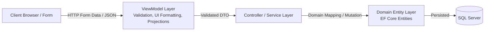

# ViewModels & Data Transfer Architecture (`Docs/ViewModels/`)

## 1. Architectural Rationale: Separation of Concerns

A core software engineering principle adhered to throughout this application is the strict separation between **Domain Entities** (`Models/`) and **Presentation/Transfer Models** (`ViewModels/`).

### Why Direct Entity Binding is Anti-Pattern in Enterprise MVC:
1. **Over-Posting (Mass-Assignment Vulnerability):**
   If an action binds directly to `Product` or `Sale`, a malicious client can inject extra JSON/Form fields (e.g., `ProductID`, `CreatedAt`, `IsAdmin`, or internal counters). Model binders in ASP.NET Core will overwrite those properties unless explicitly excluded. ViewModels expose **only** the properties intended for user input on that specific screen.
2. **Decoupling Presentation from Database Structure:**
   Views frequently require aggregated or calculated data that does not exist as columns in the database table (e.g., `StockStatus`, `BadgeClass`, `CanDelete`, `BlockingReason`, `Subtotal`, `TotalUnitsSold`). Adding these as unmapped properties to Domain Entities pollutes the domain layer with UI concerns.
3. **Context-Specific Validation Rules:**
   A Domain Entity enforces fundamental data constraints (e.g., maximum string length in database). A ViewModel enforces screen-specific workflow validation (e.g., "From Date must be before To Date", "Category dropdown must be a selected value > 0", or "At least one row must be added to order items").



---

## 2. Infrastructure & Generic Transfer Models

### 2.1. `PagedResult<T>` & `IPaginationInfo` (`ViewModels/PagedResult.cs`)
Enables server-side pagination across all index tables, avoiding in-memory array allocations for large datasets.

```csharp
public interface IPaginationInfo
{
    int PageNumber { get; set; }
    int PageSize { get; set; }
    int TotalItems { get; set; }
    int TotalPages { get; }
    bool HasPreviousPage { get; }
    bool HasNextPage { get; }
    int StartItemIndex { get; }
    int EndItemIndex { get; }
}

public class PagedResult<T> : IPaginationInfo
{
    public List<T> Items { get; set; } = new();
    public int PageNumber { get; set; } = 1;
    public int PageSize { get; set; } = 10;
    public int TotalItems { get; set; } = 0;
    public int TotalPages => (int)Math.Ceiling((double)TotalItems / Math.Max(1, PageSize));
    public bool HasPreviousPage => PageNumber > 1;
    public bool HasNextPage => PageNumber < TotalPages;
    public int StartItemIndex => TotalItems == 0 ? 0 : (PageNumber - 1) * PageSize + 1;
    public int EndItemIndex => Math.Min(PageNumber * PageSize, TotalItems);
}
```

- **Architectural Value:** Generic implementation allows reusable pagination across `ProductListItemViewModel`, `CategoryListItemViewModel`, `PurchaseListItemViewModel`, etc. Computes display window metrics (e.g., "Showing items 21 to 30 of 142") seamlessly.

---

### 2.2. `OperationResult` & `DeleteCheckResult` (`ViewModels/OperationResult.cs`)
Encapsulates command outcomes and referential integrity delete checks without relying on throwing expensive CLR exceptions for standard validation paths.

- **`OperationResult`:** Returns `{ Success: bool, Message: string, Errors: List<string> }` using static factory methods `Ok(msg)` and `Fail(error)`.
- **`DeleteCheckResult`:** Used before rendering deletion confirmation dialogs:
  ```csharp
  public class DeleteCheckResult
  {
      public bool CanDelete { get; set; } = true;
      public string EntityName { get; set; } = string.Empty;
      public int EntityID { get; set; }
      public string DisplayName { get; set; } = string.Empty;
      public string BlockingReason { get; set; } = string.Empty;
      public List<string> Details { get; set; } = new();
      public int RelatedProductsCount { get; set; }
      public int RelatedPurchasesCount { get; set; }
      public int RelatedSalesCount { get; set; }
      public int RelatedMappingsCount { get; set; }
  }
  ```
  If a record is linked to active transactions, `CanDelete` is set to `false`, disabling the delete submit button and displaying a transparent explanation to the user.

---

## 3. Module ViewModels Catalog

### 3.1. Products ViewModels (`ViewModels/ProductViewModels.cs`)

| ViewModel Class | Purpose & Data Encapsulation |
| :--- | :--- |
| `StockStatusFilter` (Enum) | `All = 0, InStock = 1, LowStock = 2, OutOfStock = 3`. Used by index filter forms to filter items by stock health. |
| `ProductListItemViewModel` | Flattened representation for catalog grid. Encapsulates category name (joined from `Category`), supplier mapping count, calculated `StockStatus` ("In Stock", "Low Stock", "Out of Stock"), and Bootstrap `StockBadgeClass`. |
| `ProductFilterViewModel` | Captures search term, selected `CategoryID`, status filter, current `Page`, and `PageSize`. Houses the `Categories` `SelectList` collection for dropdown rendering. |
| `ProductFormViewModel` | DTO used for both `Create` and `Edit` actions. Enforces range validations on price ($0.01 - $100,000) and stock limits (0 - 10,000), decoupling form input from internal entity navigation properties. |
| `ProductSupplierItemViewModel` | Projections of vendors linked to this product in Details view, including contract prices and lead times. |
| `ProductDetailsViewModel` | Comprehensive composite model displaying product specifications, stock status badge, historical transaction counts (`PurchaseItemsCount`, `SaleItemsCount`), and active supplier contracts. |
| `ProductDeleteViewModel` | Deletion safety model. Evaluates `CanDelete => PurchaseItemsCount == 0 && SaleItemsCount == 0` and formats a human-friendly `BlockingReason` if transactions exist. |

---

### 3.2. Categories ViewModels (`ViewModels/CategoryViewModels.cs`)

| ViewModel Class | Purpose & Data Encapsulation |
| :--- | :--- |
| `CategoryListItemViewModel` | Grid projection including `ProductsCount` and total aggregated inventory valuation for that category. |
| `CategoryFilterViewModel` | Captures search queries, pagination state, and sorting options for categories index. |
| `CategoryFormViewModel` | Form model with localized validation for Category Name (2–100 characters) and Description (up to 500 characters). |
| `CategoryDetailsViewModel` | Category details with nested collection of products currently assigned to this category. |
| `CategoryDeleteViewModel` | Prevents deletion if `ProductsCount > 0`, explicitly listing the blocking products preventing deletion. |

---

### 3.3. Suppliers ViewModels (`ViewModels/SupplierViewModels.cs`)

| ViewModel Class | Purpose & Data Encapsulation |
| :--- | :--- |
| `SupplierListItemViewModel` | Grid projection displaying vendor contact info, mapped product contract count, and total purchase order count. |
| `SupplierFilterViewModel` | Search filter by company name, contact person, or phone number. |
| `SupplierFormViewModel` | Validates contact details using `[Phone]` and `[EmailAddress]` annotations. |
| `SupplierDetailsViewModel` | Displays vendor contact profile alongside all contractually supplied products and executed purchase orders. |
| `SupplierDeleteViewModel` | Enforces referential integrity check: blocks deletion if the supplier is tied to historical `Purchases`. |

---

### 3.4. Supplier-Product Mappings ViewModels (`ViewModels/SupplierProductViewModels.cs`)

| ViewModel Class | Purpose & Data Encapsulation |
| :--- | :--- |
| `SupplierProductListItemViewModel` | Tabular row showing the Supplier Name, Product Name, SKU, Contract Price, and Lead Time Days. |
| `SupplierProductFilterViewModel` | Filters mappings by specific Supplier or Product. |
| `SupplierProductFormViewModel` | Form model for creating/updating contract agreements with range validation on `ContractPrice` and `LeadTimeDays` (1 to 365 days). |
| `SupplierProductDetailsViewModel` | Audit view of contract details. |
| `SupplierProductDeleteViewModel` | Confirmation model to delete/terminate a pricing contract. |

---

### 3.5. Purchases ViewModels (`ViewModels/PurchaseViewModels.cs`)

| ViewModel Class | Purpose & Data Encapsulation |
| :--- | :--- |
| `PurchaseListItemViewModel` | Summary of procurement order header: Purchase ID, Date, Supplier Name, Total Amount, and item count. |
| `PurchaseFilterViewModel` | Procurement filter by Supplier, date range (`FromDate`, `ToDate`), and invoice search. |
| `PurchaseItemFormViewModel` | Sub-form model for each dynamic table row: `ProductID`, `Quantity`, `UnitCost`, and auto-computed `Subtotal`. |
| `SupplierProductOptionViewModel` | Autocomplete helper DTO: sends product catalog with pre-negotiated `ContractPrice` when a supplier is selected. |
| `PurchaseFormViewModel` | Complex master-detail form model housing `SupplierID`, `PurchaseDate`, and dynamic `List<PurchaseItemFormViewModel> Items`. |
| `PurchaseDetailsViewModel` | Read-only procurement receipt detailing itemized quantities, costs, and aggregate financials. |
| `PurchaseDeleteViewModel` | Deletion confirmation model with stock reversal notification. |

---

### 3.6. Sales ViewModels (`ViewModels/SaleViewModels.cs`)

| ViewModel Class | Purpose & Data Encapsulation |
| :--- | :--- |
| `SaleListItemViewModel` | Overview of POS customer sales: Sale ID, Date, Customer Name/Walk-in, Total Revenue, and Units Sold. |
| `SaleFilterViewModel` | Sales search filter by Customer Info, Date Range, and Invoice ID. |
| `SaleItemFormViewModel` | Dynamic cart item line: `ProductID`, `Quantity`, `UnitPrice`, `AvailableStock`, and calculated `Subtotal`. |
| `SaleProductOptionViewModel` | Client-side inventory catalog: contains `ProductID`, `ProductName`, `SKU`, `UnitPrice`, and current `StockQuantity` to enforce client-side stock validation in the POS view. |
| `SaleFormViewModel` | Master-detail model for Point-of-Sale checkout, managing customer metadata and dynamic cart collection. |
| `SaleDetailsViewModel` | Formatted printable invoice layout with generated `InvoiceNumber` (`INV-000123`), store contact header, itemized breakdown, and payment confirmation status. |
| `SaleDeleteViewModel` | Deletion model with warning explaining that stock quantities will be restored back to inventory. |

---

### 3.7. Dashboard & Analytics ViewModels (`ViewModels/DashboardViewModels.cs`)

| ViewModel Class | Purpose & Data Encapsulation |
| :--- | :--- |
| `DashboardViewModels` | Composite root model for executive analytics: KPI statistics (Total Products, Low Stock Count, Total Valuation, Total Sales Revenue, Total Purchases), low stock table, top sellers, and recent timeline activity. |
| `LowStockProductViewModel` | Concise record for items at or below reorder threshold. |
| `TopSellingProductViewModel` | Aggregated merchandise records ordered by total units sold and revenue generated. |
| `RecentActivityViewModel` | Polymorphic unified timeline item blending incoming purchases and outgoing sales ordered chronologically. |
| `SalesVsPurchasesChartViewModel` | Chart.js DTO: formatted month labels, monthly sales revenue array, and monthly procurement expenditure array. |
| `CategoryDistributionChartViewModel` | Chart.js DTO: category names and product volume distribution for donut chart rendering. |

---

### 3.8. Reports & Stock Valuation ViewModels (`ViewModels/ReportViewModels.cs`)

| ViewModel Class | Purpose & Data Encapsulation |
| :--- | :--- |
| `StockHealthItemViewModel` | Granular stock valuation row: calculates item inventory worth (`StockQuantity * UnitPrice`) and stock health state. |
| `StockHealthReportViewModel` | Full catalog inventory valuation summary: Total valuation capital, In-Stock vs Low-Stock vs Out-of-Stock counts, with category and status filter capabilities. |
| `SalesSummaryItemViewModel` | Individual transaction breakdown within a sales period. |
| `SalesReportViewModel` | Executive revenue summary: Total Revenue, Total Orders, Total Units Sold, Average Order Value (AOV), and date preset filters (Today, This Week, This Month, This Year, Custom). |
