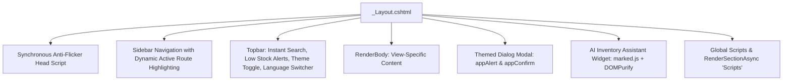

# Views & User Experience Architecture (`Docs/Views/`)

## 1. Architectural Philosophy of the UI Layer

The presentation layer is designed to provide an enterprise-grade, desktop-class user experience. Built with **Razor Views (.cshtml)**, **Bootstrap 4.6 (SB Admin 2 baseline)**, and a **Vanilla CSS Design System**, it combines high visual polish with responsive performance.

### Key Architectural Pillars:
1. **Zero Layout Shift & Anti-Flicker Execution:** Synchronous script execution in `<head>` ensures theme tokens and text direction are applied before the DOM renders.
2. **Real-Time Client Calculations:** POS sales and purchase builders compute subtotals, tax/discounts, and grand totals client-side in real time before submitting to server-side transactional validation.
3. **Cohesive Theming & Dual-Mode Contrast:** Dark mode by default with a high-contrast Light mode powered by centralized CSS custom properties.
4. **First-Class RTL Bi-Directional Support:** Native mirror styling for right-to-left languages (Arabic).
5. **No Native Browser Popups:** All `alert()` and `confirm()` prompts are replaced with custom themed, keyboard-accessible dialog modals.

---

## 2. Master Layout Architecture (`Views/Shared/_Layout.cshtml`)

`_Layout.cshtml` serves as the shell for the entire application, housing navigation, notification centers, search, and global modal infrastructure:



---

## 3. Functional Areas Deep-Dive

### 3.1. Analytics Dashboard (`Views/Dashboard/Analytics.cshtml`)
The executive command center provides immediate visibility into warehouse health:

- **Executive KPI Cards:**
  - **Total Products:** Total catalog volume.
  - **Total Stock Units:** Aggregated physical pieces currently in the warehouse.
  - **Inventory Valuation:** Total capital tied up in stock (`Sum(StockQuantity * UnitPrice)`).
  - **Low Stock Alerts:** Items requiring immediate reorder.
  - **Sales Revenue & Procurement Costs:** Financial flows for the current fiscal period.
- **Chart.js Visualizations:**
  - **Sales vs. Purchases (Line/Bar Chart):** Compares monthly revenue against procurement expenditures.
  - **Category Inventory Distribution (Donut Chart):** Visualizes stock density across categories.
- **Operational Data Tables:**
  - **Low Stock Attention List:** Quick-action table with direct links to generate purchase orders.
  - **Top-Selling Merchandise:** Identifies highest-volume items.
  - **Recent Activity Stream:** Blended chronological feed of recent sales and incoming shipments.

---

### 3.2. Point-of-Sale Checkout (`Views/Sales/Create.cshtml`)
An interactive, dynamic transaction register designed for fast cashier operations:

- **Client-Side Product Catalog:** Pre-loaded JSON catalog containing `ProductID`, `ProductName`, `SKU`, `UnitPrice`, and current `StockQuantity`.
- **Dynamic Line Item Manipulation:**
  - Add/remove line items dynamically via jQuery with row re-indexing (`Items[0].ProductID`, `Items[1].ProductID`).
  - Dropdown product selection auto-populates unit selling price and sets maximum quantity constraints based on live on-hand stock.
- **Real-Time Client-Side Validation:**
  - Prevents adding the same product twice across multiple rows.
  - Alerts the operator immediately if a requested quantity exceeds available stock.
  - Blocks submitting an empty invoice using custom themed dialog alerts.
- **Auto-Calculated Totals:** Recalculates line subtotals and grand totals instantly upon any quantity or price change.

---

### 3.3. Sales Receipt & Invoice View (`Views/Sales/Details.cshtml`)
- Generates a professional, branded commercial sales invoice (`INV-000123`).
- Formatted for clean desktop printing (`@media print` rules hide sidebars, navigation bars, and topbars, showing only the invoice bill).

---

### 3.4. Purchase Order Entry (`Views/Purchases/Create.cshtml`)
- **Supplier-Driven Catalog Loading:** Selecting a supplier triggers an AJAX call to `/Purchases/GetSupplierProducts`, populating the row product dropdowns with **only the products supplied by that vendor** and auto-populating their pre-negotiated **contract price**.
- **Dynamic Costing:** Allows operators to adjust actual unit costs while auto-calculating total purchase commitment.

---

### 3.5. Inventory Valuation Report (`Views/Reports/StockValuation.cshtml`)
- Provides financial audit tables with per-item valuation (`StockQuantity * UnitPrice`).
- Category and stock status filters.
- Direct export to CSV via `/Reports/ExportStockValuationCsv`.

---

## 4. Theme Engine: Dark Mode Baseline vs. Light Mode

The design system uses CSS Custom Properties (CSS variables) declared in `wwwroot/css/site.css`:

| CSS Variable | Dark Mode (Default) | Light Mode (`[data-theme="light"]`) | Usage |
| :--- | :--- | :--- | :--- |
| `--bg-body` | `#0f172a` (Deep Slate) | `#f8fafc` (Light Cool Gray) | Main page background |
| `--bg-surface` | `#1e293b` (Elevated Navy) | `#ffffff` (Pure White) | Card containers, sidebar, panels |
| `--bg-surface-elevated` | `#243048` | `#ffffff` | Modals, floating dropdowns |
| `--text-main` | `#f8fafc` | `#1e293b` | Primary text and headings |
| `--text-muted` | `#94a3b8` | `#64748b` | Secondary labels, descriptions |
| `--border-default` | `rgba(255, 255, 255, 0.1)` | `#e2e8f0` | Card borders, dividers, table borders |
| `--primary` | `#6366f1` (Indigo Glow) | `#4f46e5` | Primary buttons, active nav, accents |
| `--primary-gradient` | `linear-gradient(135deg, #6366f1, #4f46e5)` | `linear-gradient(135deg, #4f46e5, #4338ca)` | CTA buttons and branding |

### Anti-Flicker Synchronous Theme Detection
To avoid the jarring white/dark flash when loading pages:
```html
<head>
    <script>
        (function () {
            try {
                var savedTheme = localStorage.getItem('ims_theme') || 'dark';
                if (savedTheme === 'light') {
                    document.documentElement.setAttribute('data-theme', 'light');
                } else {
                    document.documentElement.setAttribute('data-theme', 'dark');
                }
            } catch (e) {}
        })();
    </script>
</head>
```
Because this script executes synchronously before the stylesheet parses, the browser paints the correct theme on the very first frame.

---

## 5. Bi-Directional RTL Engine (Arabic Support)

When the active culture is Arabic (`ar`), the root layout sets `<html lang="ar" dir="rtl">` and imports `wwwroot/css/rtl.css`.

### Mirroring Adaptations:
1. **Sidebar Navigation:** Automatically positions to the right-hand side; margins invert (`margin-right` replaces `margin-left`).
2. **Topbar & Dropdowns:** Profile, language, and notification dropdowns align to the left side (`dropdown-menu-left`).
3. **Form Controls:** Text alignment defaults to right; input icons flip from left padding to right padding.
4. **Data Tables:** Numerical values, currency signs, and actions column switch to reverse layout.
5. **AI Chatbot Widget:** Moves from bottom-right (`right: 24px`) to bottom-left (`left: 24px`) to preserve natural reading flow.

---

## 6. Themed Dialog Modal Subsystem (`appAlert` & `appConfirm`)

To eliminate disjointed native browser popups (`window.alert` and `window.confirm`), the application embeds a custom glassmorphic modal controller directly in `_Layout.cshtml`:

```javascript
// Native browser alerts are seamlessly routed to the themed modal
window.alert = function (message) {
    window.appAlert(message);
};

// Returns a Promise<bool> enabling clean async/await syntax:
const confirmed = await window.appConfirm('Are you sure you want to proceed?', {
    title: 'Confirm Action',
    type: 'warning',
    confirmText: 'Yes, Proceed',
    cancelText: 'Cancel'
});
```

### Features:
- **Async/Promise Architecture:** Replaces blocking browser calls with modern asynchronous promises (`await window.appConfirm(...)`).
- **Semantic Themes:** Types include `info`, `success`, `warning`, and `danger`/`error` with distinct dynamic animated icons and accent glows.
- **Full Keyboard & Backdrop Accessibility:** Closes on `Escape` key, backdrop click, or Cancel button; auto-focuses the action button on appearance.
- **Complete Culture Localization:** Button labels ("Confirm", "Cancel", "OK") and default titles dynamically adapt to the active language via `window.AppDialogTranslations`.
