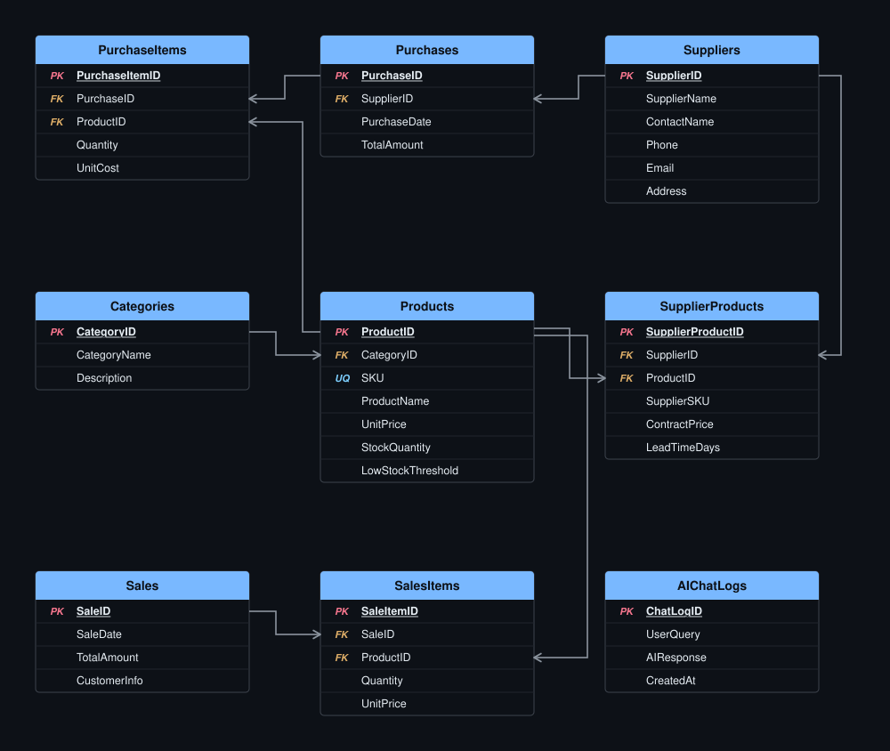

# 🚀 Inventory Management System (IMS) — ITI Graduation Project

Welcome to the official repository for **Team 03** graduation project at the **Information Technology Institute (ITI)** — .NET Full Stack Web Development Track.

---

## 📑 Table of Contents

- [About The Project](#about-the-project)
- [Key Core Capabilities](#key-core-capabilities)
- [Team Members (Team 03)](#team-members-team-03)
- [Tech Stack & Architecture](#tech-stack--architecture)
- [Project Execution Status & Roadmap](#project-execution-status--roadmap)
- [Database Architecture (ERD & Schema)](#database-architecture-erd--schema)

---

## 📌 About The Project

The **Inventory Management System (IMS)** is an enterprise-grade web application built to streamline product tracking, vendor mapping, purchase orders, point-of-sale transactions, and real-time analytical reporting. The system also features **Generative AI integration** (RAG Chatbot) to deliver natural-language inventory insights and intelligent restock recommendations.

### 🌟 Key Core Capabilities
- **Real-time Inventory Tracking**: Automatic stock additions on purchases and deductions on sales with zero negative stock tolerance.
- **Supplier & Vendor Mapping**: Full Many-to-Many relationship management between suppliers and products with custom contract pricing.
- **Dynamic Search & Filtering**: Advanced catalog filtering by categories, low-stock thresholds, and status.
- **Interactive Dashboard**: Real-time KPI summaries, low-stock alerts, and analytical charts.
- **AI-Powered Assistant**: Natural-language query interface powered by RAG over database entities.

---

## 👥 Team Members (Team 03)

* 👨‍💻 **Abdulrahman Hani Mahmoud Ali**
* 👨‍💻 **Mahmoud Sami Abdullah SayedAhmed**
* 👩‍💻 **Shimaa Reda Elsayed Elmorshedy**
* 👨‍💻 **Youssef Ali Abo Khallaf**

---

## 🛠️ Tech Stack & Architecture

| Layer | Technology Used |
| :--- | :--- |
| **Framework & Language** | C# / ASP.NET Core MVC (Version 10.0) |
| **Database & ORM** | Entity Framework Core (Code-First Approach) / SQL Server |
| **Frontend** | HTML5, CSS3, JavaScript (ES6+), Bootstrap 5, FontAwesome, Chart.js |
| **AI Integration** | Generative AI LLM API (Gemini / OpenAI) with RAG Architecture |
| **Version Control** | Git & GitHub |

---

## 🚦 Project Execution Status & Roadmap

The project development is structured into 6 core functional modules following a strict phase-by-phase execution pipeline:

| Status | Module Name | Primary Responsibilities & Features | Database Entities Involved |
| :---: | :--- | :--- | :--- |
| ✅ **Completed** | **M1: Products & Categories** | Catalog CRUD, server-side pagination, dynamic search/filter, SKU generation. | `Product`, `Category` |
| ✅ **Completed** | **M2: Suppliers & Vendor Mapping** | Supplier profiles, Many-to-Many vendor mapping, contract pricing, lead time tracking. | `Supplier`, `SupplierProduct` |
| ⏳ *In Progress* | **M3: Purchases (Stock In)** | Procurement orders, multi-item line rows, **automated stock addition**. | `Purchase`, `PurchaseItem` |
| ⏳ *In Progress* | **M4: Sales (Stock Out)** | POS invoice generation, **automated stock deduction**, price snapshots. | `Sale`, `SaleItem` |
| ✅ **Completed** | **M5: Dashboard & Analytics** | Centralized KPIs, low-stock alerts, top-selling products, recent activity logs. | Aggregated System Tables |
| ⏳ *In Progress* | **M6: Generative AI Assistant** | Inventory RAG Chatbot, natural-language analytics, restock recommendations. | `AIChatLog` |

---

## 📐 Database Architecture (ERD & Schema)

The database design adheres to 9 relational entities (8 core + optional AI logs) configured via Entity Framework Core Fluent API:

---

© 2026 **Team 03** — Information Technology Institute (ITI). All Rights Reserved.
